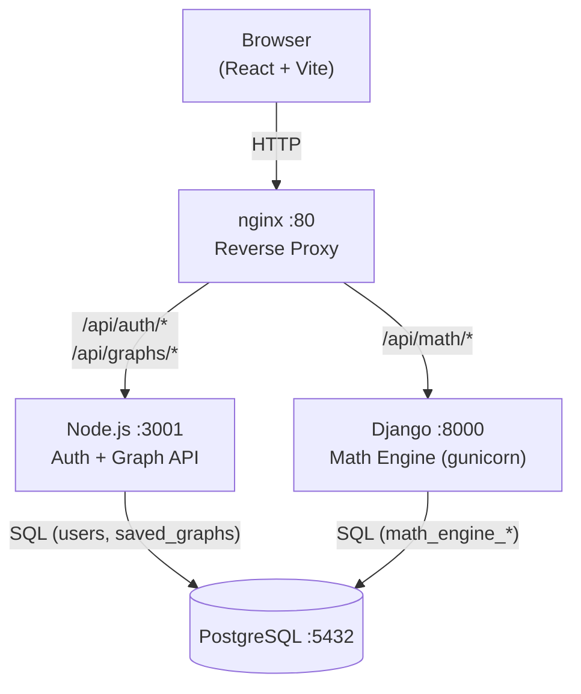

# Visualequ

**Interactive Math Equation Visualizer** — graph Cartesian, parametric, and polar equations in a browser with real-time evaluation powered by SymPy.

---

## Architecture



### Database table ownership

| Table | Owner | Purpose |
|---|---|---|
| `users` | **Node.js** | User accounts (bcrypt passwords, JWT) |
| `saved_graphs` | **Node.js** | Persisted equation sets per user |
| `math_engine_equation` | **Django** | Evaluation cache / audit log |
| `math_engine_savedgraph` | **Django** | (Optional) Django-side graph metadata |

Node.js and Django share the same PostgreSQL instance.  Django can reference `users.id` directly for any future cross-service queries.

---

## Quick start

```bash
# 1. Clone & copy environment files
cp backend-node/.env.example  backend-node/.env
cp frontend/.env.example      frontend/.env

# 2. Start all services (dev mode)
docker compose --profile dev up --build

# 3. Open
#   Frontend:  http://localhost:5173   (Vite dev server)
#   Via nginx: http://localhost:80
#   Node docs: http://localhost:3001/api-docs
#   Django docs: http://localhost:8000/api/docs/
```

### Production build

```bash
cd frontend && npm run build
# Uncomment the nginx volume in docker-compose.yml that mounts ./frontend/dist
docker compose up --build   # (no --profile dev)
```

---

## HTTPS (local dev / production)

**Self-signed cert (local dev):**

```bash
mkdir -p nginx/ssl
openssl req -x509 -nodes -days 365 -newkey rsa:2048 \
  -keyout nginx/ssl/key.pem \
  -out    nginx/ssl/cert.pem \
  -subj   "/CN=localhost"
```

Then uncomment the `443` server block in `nginx/nginx.conf` and the `443:443` port in `docker-compose.yml`.

**Let's Encrypt (production):** Replace `nginx/ssl/cert.pem` and `nginx/ssl/key.pem` with your Certbot-issued certificates and set a real `server_name` in `nginx.conf`.

---

## Features

### Math
- **Cartesian**  `y = f(x)` — evaluated server-side by SymPy/NumPy
- **Parametric** `x(t), y(t)` — evaluated client-side via math.js
- **Polar**      `r = f(θ)` — evaluated client-side via math.js
- **Variable sliders** — free variables auto-detected; sliders re-evaluate on change
- **Roots & Intersections** panel — powered by SymPy `solve` / `nsolve`

### UX
- Live mouse x/y coordinate readout on the graph
- Loading spinner during backend evaluation
- Toast notifications for all API errors
- PNG and SVG export

### Performance
- 300 ms client-side debounce on expression input
- `requestAnimationFrame` canvas draw loop
- Django result caching (5 min TTL, keyed by expression + range)

### Security
- Rate limiting: 10 requests / 15 min per IP on auth routes (Node + nginx)
- Strong password policy: ≥8 chars, 1 uppercase, 1 number
- Expression sanitisation: blocks `import`, `__`, `exec`, `eval`, `os`, `sys`
- 3-second server-side evaluation timeout → HTTP 408
- Input HTML stripping on graph name and expression fields

---

## API Reference

| Service | Docs URL |
|---|---|
| Node.js (Swagger UI) | `http://localhost:3001/api-docs` |
| Django (Swagger UI)  | `http://localhost:8000/api/docs/` |
| Django (OpenAPI JSON) | `http://localhost:8000/api/schema/` |

---

## Testing

```bash
# Django (pytest)
cd backend-django
pip install -r requirements.txt
pytest math_engine/tests/ -v

# Node.js (Jest + Supertest)
cd backend-node
npm install
npm test

# Frontend (Jest + RTL)
cd frontend
npm install
npm test
```

---

## Environment variables

### `backend-node/.env`

| Variable | Description |
|---|---|
| `DB_NAME` | PostgreSQL database name |
| `DB_USER` | PostgreSQL user |
| `DB_PASSWORD` | PostgreSQL password |
| `DB_HOST` | PostgreSQL host (use `postgres` in Docker) |
| `JWT_SECRET` | Secret for signing JWT tokens |
| `PORT` | Node.js listen port (default 3001) |

### `backend-django` (set in docker-compose or `.env`)

| Variable | Description |
|---|---|
| `DJANGO_SECRET` | Django secret key |
| `DB_*` | Same as above |
| `DEBUG` | `"True"` for dev, `"False"` for production |

---

## Caching (Django)

The math engine uses Django's cache framework, defaulting to `LocMemCache` (in-process).  
For multi-worker production deployments, switch to Redis in `settings.py`:

```python
CACHES = {
    'default': {
        'BACKEND': 'django.core.cache.backends.redis.RedisCache',
        'LOCATION': 'redis://redis:6379/1',
    }
}
```

Then add a `redis` service to `docker-compose.yml`.

---

## Future work

- Migrate user management to Django (single ORM source of truth, Django `auth_user` table)
- 3D surface plotting via Three.js
- Symbolic differentiation / integration panel
- Shareable graph URLs
